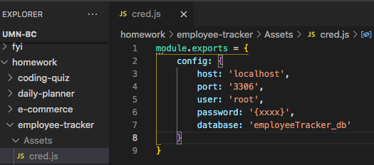
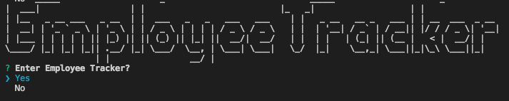
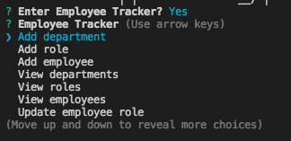
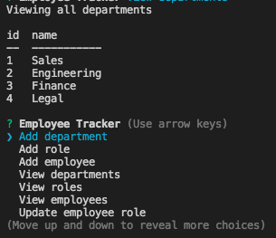
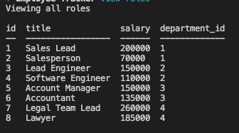
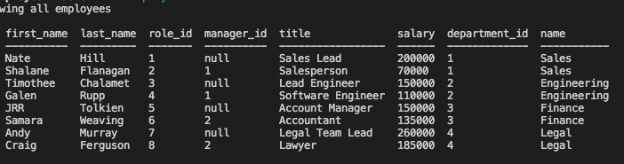
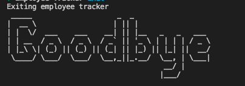

# employee-tracker

 ## Table of Contents

  - [Description](#description)
  - [Installation](#installation)
  - [Usage](#usage)
  - [Contributing](#contributing)
  - [License](#license)
  - [Tests](#tests)
  - [Questions](#questions)
  - [Demo](#demo)
  - [Screenshots](#screenshots)

  ## Description

  What is this app and what does it do:

  This app is designed for a user placeholder.

  Technologies used: placeholder.

  * To see the app in action, check out the demo in the Demo section below.

  ## Installation

  To install npm dependencies (mysql, inquirer), please use this command >> npm install

  ## Usage

  Here's the essentials for what you need to know to use this app: 

  Placeholder.

  ## Contributing

  To contribute to this app, please follow these instructions: 
  
  Please add descriptive commit messages and comments. Remember to do a npm install for mysql, inquirer, and other relevant packages, then create a .gitignore for the node_modules and package-lock.json folder if/when pushing to GitHub.

  ## License
  
  * No applicable license for this app

  ## Tests

  No tests were developed. 
  
  ## Questions

  * If you have any questions/concerns regarding the app, please contact me on GitHub here: https://github.com/tedheikkila

  ## Demo

  * Check out the app's demo tutorial here >> https://drive.google.com/file/d/1QvgWCmkjkXdT6kwIBDIYV9xa-PmxQHhw/view?usp=sharing 

  ## Screenshots

  * cred file setup (best practice use .env file setup; this app uses gitignore for assets folder, which contains the cred.js file)

  

   * homepage

  

   * start menu

  

  * all departments

  

   * all roles

  

   * all employees

  

   * app closes

  

